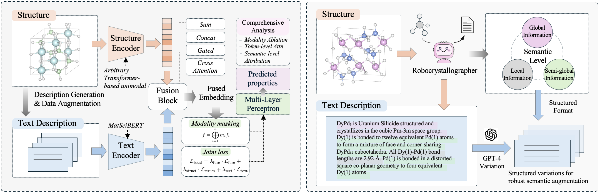

# Towards General and Interpretable Multimodal Framework for Transformer-Based Crystal Property Prediction



> Early-stage research exploration (Apr–Jun 2025), independently designed and implemented by **Jingwen Yang** under supervision of **Prof. Wanyu Lin** and **Haowei Hua (PhD student)**.  

This repository documents the initial prototype and conceptual design of **MultimodalCPF** — a general-purpose transformer-based framework for multimodal **crystal property prediction**. Although the project was not pursued further temporarily, it substantially shaped my subsequent work on structure–text fusion, interpretability, and training strategy design in scientific machine learning. The narrative below is adapted from an extended abstract written during the project.

---

## 🗂 Directory Structure (Multimodal Components)

This repository is organized to separate unimodal baselines and related external code from all custom multimodal components.

```
MultimodalCPF/
├── models/                   # reusable structure encoders (e.g., CrystalFormer, etc.)
├── related_repo/             # external multimodal frameworks (for reference only)
├── unimodal/                 # unimodal training pipeline, original dataloaders & configs
├── multimodal_fusion/        # all custom modules for multimodal modeling
│   ├── data_processing/          # precompute text & structure representations for fast training
│   │   ├── precompute_text_embedding.py / .sh
│   │   ├── precompute_structure_input.py / .sh
│   │   ├── precompute_text_token.py / .sh
│   │   ├── precompute_data_list.py / .sh
│   ├── tools/                   # simple debug and sanity-check scripts
│   │   ├── debug.py, demo.py, demo.sh
│   │   └── structure_none.py
│   ├── dataset_fusion.py        # dataset wrapper for multimodal structure–text input
│   ├── default_fusion.json      # training config file (can edit fusion type, encoders, loss weights, etc.)
│   ├── encoder_selector.py      # handles structure encoder selection based on config
│   ├── fusion_block.py          # pluggable fusion modules: sum / concat / gated / cross-attn
│   ├── fusion_loss.py           # compute joint loss over fusion + unimodal branches
│   ├── mask_strategy.py         # apply modality masking & dropout during training
│   ├── regression_fusion.py     # main multimodal regression model
│   └── text_encoder.py          # load frozen MatSciBERT as text encoder
├── utils.py                     # shared utility functions
├── train_fusion.py              # training script (entry point)
└── train_fusion.sh              # run script with core hyperparameter settings
```

> 🔧 Note: Only the following are developed from scratch: `multimodal_fusion/`, `train_fusion.py`, and `train_fusion.sh`.
> Other folders store original or referenced code for reproducibility.

---

## 🧠 Motivation

Accurate prediction of crystal properties without costly physical synthesis is critical for accelerating sustainable materials discovery, particularly in areas such as energy storage, catalysis, and green electronics. Deep learning has emerged as a powerful alternative to traditional simulations, but most state-of-the-art models remain **unimodal**, relying solely on structural input. This limits their capacity to capture high-level periodic features like symmetry, long-range atomic interactions, or bonding environments—elements that are often difficult to express through structure alone.

Textual descriptions, on the other hand, encapsulate semantic information such as space groups, coordination geometry, and crystal system in a way that complements structural data. Integrating these two modalities promises more robust and semantically enriched predictions. Yet existing multimodal frameworks are often limited in scope and design. Specifically:

- They are predominantly **GNN-based** with shallow fusion mechanisms;
- They **underutilize transformer encoders**, despite their expressive power;
- They lack **interpretability** and **modality-aware training objectives**.

This project proposes a general and interpretable multimodal framework compatible with transformer-based encoders. It supports flexible fusion mechanisms, token-level interpretability, and modality dropout training strategies, aiming to enable scalable and explainable property prediction for scientific applications.

---

## 🎯 Project Objectives

- Build a **general, transformer-compatible multimodal framework** for crystal property prediction via unified, modular interfaces.  
- Support **pluggable fusion modules**: sum, concat, gated, and **cross-attention**.  
- Integrate **transformer-based model** (structure encoder) and **MatSciBERT** (text encoder) in a cohesive pipeline.  
- Develop a **modality-aware training strategy** featuring:
  - joint supervision on fusion / structure-only / text-only branches (weighted loss),
  - modality masking/dropout,
  - semantic-level text augmentation (e.g., paraphrasing).  
- Provide **token-level interpretability** via attention visualization, modality masking, and token ablation.

---

## 🔧 Methodology Overview

**Model Components (Encoders & Fusion)**  
- **Structure encoder**: Transformer-based (e.g., CrystalFormer) for periodic structure encoding.  
- **Text encoder**: Frozen **MatSciBERT** to capture high-level semantic cues such as space group and bonding environment.  
- **Fusion module**: Supports pluggable strategies including **sum**, **concat**, **gated fusion**, and **cross-attention** for token-level structure–text integration.

**Training Strategy**  
- **Joint loss** across fusion and unimodal branches to stabilize cross-modal alignment.  
- **Modality masking/dropout** to simulate missing-modality scenarios and enhance robustness.  
- **Semantic text augmentation** using Robocrystallographer + paraphrasing to enrich textual input.

**Interpretability Suite**  
- Token-level **attention visualization** to trace model focus.  
- **Token/region ablation** to assess contribution of different text components (e.g., global vs. local).  
- **Modality masking** to quantify modality-specific contributions to prediction.

---

## 💬 Reflections & Follow-up

This project, while temporarily not continued beyond the prototype stage, was a valuable experience in understanding the challenges of multimodal learning for scientific data. From dataset design to model abstraction, I encountered many practical and conceptual issues—particularly around cross-modal alignment, modality imbalance, and architecture stability.

Although I decided to shift my focus away from crystal-specific modeling, this early exploration laid a critical foundation for my later work on **token-level fusion**, **modality-aware training**, and **explainability**, which continue to shape my research in **trustworthy multimodal reasoning**.

If you're working on related topics or interested in extending this direction (e.g., incorporating molecular knowledge graphs, visual grounding, or human-in-the-loop interpretability), feel free to reach out or fork the repo. I’d love to connect and exchange ideas 🤍

> 📩 Email: jingwen.yang@connect.polyu.hk  
> 💬 WeChat: 18981991005

